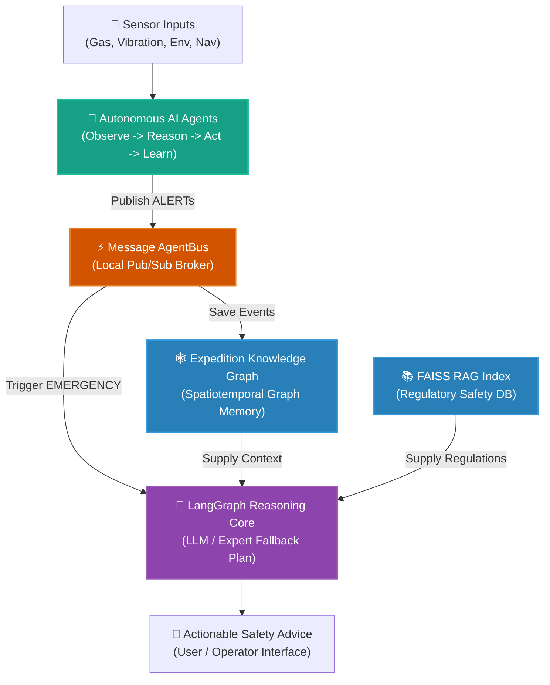

# FIELD-MIND — Underground Mining Multimodal AI Agent System

FIELD-MIND is an offline multimodal intelligence platform developed for underground mining operations. It hosts machine learning pipelines, autonomous sensor AI agents, preprocessing scripts, datasets, and serialized models across four primary sensor domains: **Gas Safety**, **Environmental (Temperature & Humidity)**, **Blast Vibration**, and **Robot Navigation (Ultrasonic)**.

Each sensor domain has been elevated from a passive ML model into a fully **autonomous AI agent** — capable of perceiving its environment, reasoning about hazards, acting by publishing alerts, and continuously **learning from original datasets** through an experience replay buffer.

---

## Architecture Overview

FIELD-MIND is structured as an offline, edge-native safety intelligence loop:



### Agent Cycle (per tick)
```
1. OBSERVE  → reads raw sensor data (from original dataset stream)
2. REASON   → runs domain ML models → computes hazard confidence score
3. ACT      → if confidence ≥ 0.5 for 2+ consecutive ticks → publish ALERT
4. LEARN ★  → dataset label stored in replay buffer (size=200)
              When buffer is full → retrain model → swap live model atomically
```

---

## Modules Overview

### 1. Gas Sensors (`gas_sensors/`)
Processes real-time multi-gas inputs (MQ-2, MQ-3, MQ-4, MQ-7, MQ-135, MQ-136, MG811 arrays) to identify hazards:
- **Synthetic Data Generation**: Models Gaussian plumes, ventilation cycles, machinery startup emissions, and sensor drift.
- **Methane Detection**: Employs a hybrid **SVM + MLP Voting Classifier** to predict methane levels robustly.
- **Specific Gas Classifiers**: Targets LPG/CNG, combustion gases (CO/Benzene), and smoke/fire hazards.
- **Multi-Gas Detector**: Tracks 5 gases simultaneously (Methane, CO, LPG, Smoke, NOx) using a MultiOutput Random Forest model.

### 2. Temperature & Humidity (`temperature_humidity/`)
Monitors occupational safety and environmental anomaly conditions:
- **Anomaly Detection**: Trains unsupervised **Isolation Forests** on rolling mean, variance, and humidex indices to capture microclimate anomalies.
- **Occupancy Classification**: A **Random Forest Classifier** trained on CO2, light, temperature, and humidity levels to predict office/tunnel occupancy.

### 3. Vibration (`vibration/`)
Predicts blast-induced seismic vibration levels (Peak Particle Velocity - PPV) near mine sites:
- **SEG-Y Binary Reader**: Custom parsing of big-endian IBM float headers from SEG-Y seismogram trace outputs.
- **Feature Extraction**: Calculates maximum charge, number of blast holes, trace directions (`trid`), and receptor coordinates.
- **Prediction Model**: Trains a **Gradient Boosting Regressor** for continuous PPV prediction and a **Random Forest Classifier** for threshold-based hazard alert triggers.

### 4. Ultrasonic Sensors (`ultrasonic_sensors/`)
Classifies robot navigation decisions based on 2, 4, or 24-sensor configurations:
- **Decision Classification**: Trains multiple ML algorithms (Logistic Regression, Decision Trees, Random Forests, Gradient Boosting, MLP) to predict robot commands (`Move-Forward`, `Slight-Right-Turn`, `Sharp-Right-Turn`, `Slight-Left-Turn`).

### 5. SciSense Protocol (`scisense_protocol/`)
Aligns heterogeneous underground sensor streams into a shared 4,096-dimensional embedding space:
- **Multi-Modal PyTorch Encoders**: Custom network projections featuring LayerNorm and L2 normalization for Gas, Env, Vibration, and Ultrasonic features.
- **Temporal Alignment**: Resamples and groups asynchronous sensor updates into aligned 1-second epochs.

### 6. Anomaly-Triggered Reasoning (ATR) Activation (`atr_activation/`)
Coordinates continuous background monitoring and active deep reasoning triggers:
- **Unified Model Wrappers**: Loads all pre-trained `scikit-learn` classifiers across Gas, Env, Vibration, and Navigation domains.
- **State Transition Coordinator**: Switches device state dynamically between low-power continuous monitoring (`IDLE`) and active projection + reasoning (`ACTIVE_REASONING`) to conserve RAM.

### 7. Expedition Knowledge Graph (EKG) (`expedition_knowledge_graph/`)
Persistent mine memory mapping spatial and temporal coordinates of all operations:
- **Property Graph Schema**: 7 node types (TunnelSegment, SensorNode, BlastEvent, VibrationEvent, GasAnomaly, EnvironmentalReading, Equipment) with typed relationships.
- **Data Ingestion**: Populates the graph from workspace blast, gas, and environmental CSV datasets with auto-clustered tunnel segments.
- **Query API**: High-level functions for risk profiling, gas trend analysis, blast history, and causal event correlation.
- **JSON Persistence**: Full graph save/load for offline operation across sessions.

### 8. ★ Sensor AI Agents (`sensor_agents/`) — NEW
Converts every sensor domain into an **autonomous self-learning AI agent**. Each agent runs a full Observe → Reason → Act → Learn cycle every tick, learns from original datasets via an experience replay buffer, and communicates through a shared AgentBus.

| Agent | Domain | Models Used | Dataset for Learning |
|---|---|---|---|
| `GasSensorAgent` | Gas hazard detection | 6 gas joblib models | `FIELDMIND_physics_dataset.csv` |
| `EnvSensorAgent` | Temp/humidity anomaly | IsolationForest + RF | `iot_telemetry_clean.csv` |
| `VibrationSensorAgent` | Blast PPV hazard | RF classifier + GB regressor | `vibration_features.csv` |
| `UltrasonicSensorAgent` | Robot navigation | 24-sensor RF classifier | `sensor_readings_24.csv` |
| `EKGAgent` | Long-term mine memory | Knowledge graph (NetworkX) | Subscribes to all bus ALERTs |
| `MineOrchestratorAgent` | Global hazard fusion | Weighted score fusion | All 4 sensor agents |

**Self-Learning via Experience Replay Buffer:**
- Every tick, the agent reads a labeled row from its original dataset and adds `(feature_vector, label)` to its buffer.
- When the buffer reaches **200 samples**, a fresh model is trained on the accumulated data.
- The live model is atomically replaced with the newly trained version.
- A `LEARNING_UPDATE` message is broadcast on the AgentBus.

**Verified Demo Results (300 ticks):**
- `VibrationSensorAgent`: 2 refits, in-sample accuracy **1.000**
- `UltrasonicSensorAgent`: 2 refits, in-sample accuracy **0.975**
- `EnvSensorAgent`: 2 IsolationForest refits (unsupervised)
- **260 hazard events** written to Expedition Knowledge Graph
- **6 global state transitions** including ACTIVE_REASONING → EMERGENCY

---

## Directory Structure

```
FIELD_MIND (Project)/
├── docs/                              # Project proposal and background documentation
│   └── FIELD_MIND_proposal.docx       # Full project proposal and technical spec
├── gas_sensors/                       # Gas concentration prediction & classification
│   ├── data/                          # CSV & Excel datasets (physics-informed synthetic + raw)
│   ├── models/                        # Serialized ML models & model registry metadata
│   ├── data_loader.py                 # Custom chronological & session split loaders
│   ├── generate_dataset.py            # Physics-informed synthetic dataset generator
│   ├── train.py                       # Smoke, VOC, Air Quality, and combined pipelines
│   ├── train_combined.py              # HistGradientBoosting regressor training script
│   ├── train_gas_detector.py          # Multi-Output RandomForest detector training
│   ├── train_methane.py               # Hybrid SVM + MLP Voting classifier training
│   ├── train_specific.py              # Specific gas safety hazard classifier training
│   └── Evaluation.md                  # Gas-specific classifier evaluation results
├── temperature_humidity/              # Environmental anomaly detection
│   ├── data/                          # Clean and raw datasets (Kaggle & UCI formats)
│   ├── models/                        # Unsupervised isolation forests & Random Forest classifiers
│   ├── src/
│   │   ├── preprocess.py              # Environmental logs cleanup & feature extraction
│   │   ├── train.py                   # Isolation Forest & RF training pipeline
│   │   ├── evaluate.py                # Anomaly detector & RF classifier evaluator
│   │   └── run_pipeline.py            # End-to-end execution orchestrator
│   └── model_metrics_table.md         # Performance report for environmental models
├── vibration/                         # Seismic blast vibration analysis
│   ├── data/                          # SEG-Y raw trace records and BLASTS.txt coordinates
│   ├── models/                        # Best classifier & regressor joblib files
│   ├── train_models.py                # Classifier & regressor pipelines (vibration hazards & PPV)
│   ├── vibration_data_prep.py         # Custom binary SEG-Y reader & feature extractor
│   └── model_metrics_table.md         # Blast vibration prediction evaluation report
├── ultrasonic_sensors/                # Robot navigation decision classification
│   ├── data/                          # CSV datasets (2, 4, 24 sensor readings)
│   ├── models/                        # Serialized classifier models
│   ├── train_models.py                # Training pipeline for multiple classifiers
│   └── model_metrics_table.md         # Classification performance report
├── scisense_protocol/                 # Unified multi-modal alignment layer
│   ├── encoders.py                    # PyTorch mapping encoders (Gas, Env, Vibration, Ultrasonic)
│   ├── alignment.py                   # Temporal stream synchronization logic
│   ├── demo_alignment.py              # End-to-end alignment simulation runner
│   └── README.md                      # Mathematical projection & setup documentation
├── atr_activation/                    # Anomaly-Triggered Reasoning activation layer
│   ├── detector_wrappers.py           # Unified model wrappers loading all pre-trained joblibs
│   ├── orchestrator.py                # State transition coordinator (IDLE <-> ACTIVE)
│   ├── demo_atr.py                    # End-to-end streaming trigger simulation runner
│   └── README.md                      # System state and loaded models documentation
├── expedition_knowledge_graph/        # Persistent mine knowledge graph (Layer 2B)
│   ├── schema.py                      # Property graph node/edge type definitions
│   ├── graph_store.py                 # NetworkX graph engine with JSON persistence
│   ├── ingest.py                      # CSV data ingestion pipelines
│   ├── query_api.py                   # High-level query functions for reasoning agent
│   ├── demo_ekg.py                    # End-to-end ingestion and query demo
│   ├── data/mine_graph.json           # Serialised graph (created after running demo)
│   └── README.md                      # Schema, query, and design documentation
├── sensor_agents/                     # ★ Autonomous Sensor AI Agent Layer
│   ├── __init__.py                    # Package exports (all agents, bus, message types)
│   ├── agent_bus.py                   # Publish/subscribe AgentBus & AgentMessage dataclass
│   ├── agent_base.py                  # Abstract base: Observe→Reason→Act→Learn + replay buffer
│   ├── gas_agent.py                   # GasSensorAgent (6 gas models, LPG/CNG primary learner)
│   ├── env_agent.py                   # EnvSensorAgent (IsolationForest, unsupervised refit)
│   ├── vibration_agent.py             # VibrationSensorAgent (PPV classifier + regressor)
│   ├── ultrasonic_agent.py            # UltrasonicSensorAgent (24-sensor collision classifier)
│   ├── ekg_agent.py                   # EKGAgent (knowledge graph long-term memory)
│   ├── mine_orchestrator_agent.py     # MineOrchestratorAgent (global fusion & state manager)
│   └── demo_agents.py                 # End-to-end multi-agent streaming demo
└── unified_demo/                      # ★ NEW — Interactive Unified System Demo
    └── interactive_safety_hub.py      # Take user input, evaluate alerts, conversational response
```

---

## How to Run

A Python interpreter (version 3.10+) with required packages (`pandas`, `numpy`, `scikit-learn`, `joblib`, `openpyxl`, `langgraph`, `sentence-transformers`, `faiss-cpu`) is required.

Ensure you run all scripts from the **project root**.

### ★ Running the Interactive Safety Hub (Recommended Entry Point)
To run the interactive CLI tool where you can input custom gas concentrations, temperature, geophone vibrations, and robot proximity values to see active alerts and interact with the AI assistant:
```bash
py -X utf8 unified_demo/interactive_safety_hub.py
```

### ★ Running the AI Agent System
```bash
# Run all 5 sensor agents simultaneously (300 ticks, ~3 min)
py -X utf8 sensor_agents/demo_agents.py
```

# Longer run — triggers more self-learning cycles
py -X utf8 sensor_agents/demo_agents.py --ticks 1000

# Verbose mode — see every agent's per-tick reasoning trace
py -X utf8 sensor_agents/demo_agents.py --ticks 300 --verbose
```

**What the demo shows:**
- All 4 sensor agents running their Observe→Reason→Act→Learn loop simultaneously
- Hazard injection episodes (gas spike, env anomaly, blast, collision, multi-hazard)
- Real-time ALERT messages on the AgentBus with severity levels
- `★ LEARNING UPDATE` events when agents refit their models
- MineOrchestratorAgent state transitions: `IDLE → ACTIVE_REASONING → EMERGENCY`
- EKG agent writing all hazard events to `mine_graph.json`

### Running Gas Sensor Pipelines
```bash
# Generate the synthetic dataset
py gas_sensors/generate_dataset.py

# Train baseline classifiers
py gas_sensors/train.py

# Train specific hazard and multi-gas classifiers
py gas_sensors/train_specific.py
py gas_sensors/train_gas_detector.py
```

### Running Temperature & Humidity Pipeline
```bash
# Run the end-to-end preprocessing, training, and evaluation pipeline
py temperature_humidity/src/run_pipeline.py
```

### Running Vibration Analysis
```bash
# Extract features from raw blasts.sgy files
py vibration/vibration_data_prep.py

# Train vibration prediction models
py vibration/train_models.py
```

### Running Ultrasonic Sensor Analysis
```bash
# Train ultrasonic sensor classification models
py ultrasonic_sensors/train_models.py
```

### Running SciSense Protocol Demo
```bash
# Run the simulated multi-modal sensor alignment demo
py scisense_protocol/demo_alignment.py
```

### Running ATR Activation Demo
```bash
# Run the continuous streaming monitor and trigger simulator
py atr_activation/demo_atr.py
```

### Running Expedition Knowledge Graph (EKG) Demo
```bash
# Ingest workspace datasets, run queries, and test persistence
py -X utf8 expedition_knowledge_graph/demo_ekg.py
```

---

## Git LFS Tracking

Large binary datasets (SEG-Y files, Excel datasets, model files) are tracked using **Git Large File Storage (LFS)**. Ensure `git-lfs` is installed and initialized before pushing/pulling:
```bash
git lfs install
```
