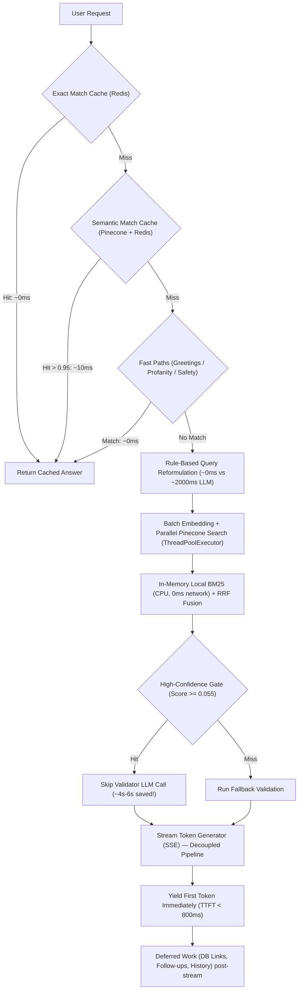

# Latency Optimization Analysis & Jetson Orin Nano Implementation Guide

## Executive Summary

This document breaks down:
1. **How `Backend_chatbot` minimized end-to-end latency and Time-To-First-Token (TTFT)** across every subsystem (caching, query reformulation, early gates, retrieval, streaming, and speech).
2. **Why local Qwen 3.5 7B Q4 GGUF on Nvidia Jetson Orin Nano produces answers all at once** instead of streaming.
3. **A complete, production-ready architecture for subsection / block-wise streaming** (buffering tokens into coherent semantic sections rather than erratic token-by-token or line-by-line dumps).
4. **Hardware and runtime latency tuning specifically tailored for Jetson Orin Nano**.

---

## Part 1: How Latency Was Reduced in `Backend_chatbot`

A deep inspection of [`chatbot.py`](file:///d:/Users/SUPRATIK/V2/V2/Backend_chatbot/chatbot.py), [`hybrid_retriever.py`](file:///d:/Users/SUPRATIK/V2/V2/Backend_chatbot/hybrid_retriever.py), [`streaming_llm.py`](file:///d:/Users/SUPRATIK/V2/V2/Backend_chatbot/streaming_llm.py), [`streaming_endpoint.py`](file:///d:/Users/SUPRATIK/V2/V2/Backend_chatbot/streaming_endpoint.py), [`main.py`](file:///d:/Users/SUPRATIK/V2/V2/Backend_chatbot/main.py), and [`sarvam_client.py`](file:///d:/Users/SUPRATIK/V2/V2/Backend_chatbot/sarvam_client.py) reveals a 6-layer latency reduction strategy:



### 1. Dual-Tier Caching Pipeline (`0ms - 15ms`)
*Located in [`chatbot.py:1059-1081`](file:///d:/Users/SUPRATIK/V2/V2/Backend_chatbot/chatbot.py#L1059-L1081) and [`pinecone_client.py:219-259`](file:///d:/Users/SUPRATIK/V2/V2/Backend_chatbot/pinecone_client.py#L219-L259)*
- **Tier 1 (Exact Match)**: Checks Redis with normalized query string (`q_clean`). If exact query was asked before, response is returned instantly (**~0.3ms - 1ms**).
- **Tier 2 (Semantic Cache)**: If exact match misses, the query embedding is searched against Pinecone under namespace `semantic_cache`. If cosine similarity $\ge 0.95$, it fetches the precomputed response JSON from Redis via hash (**~10ms - 20ms**), bypassing the LLM, vector search, and reranking entirely.

### 2. Elimination of Secondary LLM Reformulation (`~0ms` vs `~2000ms`)
*Located in [`hybrid_retriever.py:59-136`](file:///d:/Users/SUPRATIK/V2/V2/Backend_chatbot/hybrid_retriever.py#L59-L136)*
- Earlier versions invoked a secondary LLM call (`LLMReformulator`) to generate 3 search query variations, costing 1.5s to 2.5s of latency before search even started.
- Replaced by `RuleBasedReformulator`: An instant dictionary of domain synonyms and bigrams + stopword stripping that produces reformulations in **`0ms`**.

### 3. Rule-Based Fast-Paths & Early Exits
*Located in [`chatbot.py:1088-1130`](file:///d:/Users/SUPRATIK/V2/V2/Backend_chatbot/chatbot.py#L1088-L1130)*
- **Greeting Fast-Path**: Common conversational inputs (`hi`, `hello`, `thanks`, `what can you do`) are resolved via hashmap in **`0ms`**, avoiding all RAG queries and LLM prompts.
- **Out-of-Scope Fast Reject**: Queries scoring below `0.020` on retrieval are rejected without calling the LLM.
- **High-Confidence Fast-Approve (`~4s - 6s` saved)**:
  * In [`chatbot.py:1246-1270`](file:///d:/Users/SUPRATIK/V2/V2/Backend_chatbot/chatbot.py#L1246-L1270), if top vector score $\ge 0.055$ or a core syllabus keyword matches, the codebase **completely skips the secondary validator LLM call**.
  * Skipping this validation call directly shaved **4 to 6 seconds** off the query turnaround.

### 4. Parallel Retrieval & Batch Embedding
*Located in [`hybrid_retriever.py:278-301`](file:///d:/Users/SUPRATIK/V2/V2/Backend_chatbot/hybrid_retriever.py#L278-L301)*
- **Batch Embeddings**: `all_embeddings = self.pinecone_client.create_embeddings_batch(all_queries)` encodes original and reformulated queries in a single model forward-pass rather than $N$ separate calls.
- **Parallel Vector Search**: Dispatches Pinecone queries concurrently across threads via `ThreadPoolExecutor(max_workers=len(all_queries))`.
- **Local In-Memory BM25**: Runs locally on CPU via `rank_bm25` (zero network latency) and merges with vector results using Reciprocal Rank Fusion (RRF).
- **Persistent Singletons & Connection Pooling**:
  * Persistent clients for Pinecone and Neo4j (no per-request client handshake).
  * MySQL connection pooling via `pooling.MySQLConnectionPool` in [`Db.py`](file:///d:/Users/SUPRATIK/V2/V2/Backend_chatbot/Db.py#L38-L48) to eliminate TCP handshake latency.

### 5. Decoupled Streaming & Deferred Work (TTFT Optimization)
*Located in [`chatbot.py:1618-1789`](file:///d:/Users/SUPRATIK/V2/V2/Backend_chatbot/chatbot.py#L1618-L1789) and [`main.py:524-596`](file:///d:/Users/SUPRATIK/V2/V2/Backend_chatbot/main.py#L524-L596)*
- **Server-Sent Events (SSE)**: Uses FastAPI `StreamingResponse(generate(), media_type="text/event-stream")`.
- **Nginx Buffering Disabled**: Emits header `X-Accel-Buffering: no` so reverse proxies do not hold back tokens.
- **Postponed Secondary Work**:
  * Instead of calculating reference links, follow-up questions, and persisting history *before* outputting the answer, `ask_question_stream` yields tokens **immediately**.
  * MySQL reference link queries, follow-up generators, and Redis history persistence run **after** the stream terminates, packing them into a trailing SSE event.

### 6. Audio/Speech (Sarvam S2S) Latency Reduction
*Located in [`sarvam_client.py:90-155`](file:///d:/Users/SUPRATIK/V2/V2/Backend_chatbot/sarvam_client.py#L90-L155)*
- **Parallel Chunking**: Text is split into $\le 700$ character chunks.
- **Overlapped TTS & Playback**: A `ThreadPoolExecutor` fetches TTS audio for all chunks concurrently while the main thread waits on `ready_events[idx].wait()`.
- Chunk 0 begins playing as soon as it arrives, while Chunks 1..N are still generating over the network.
- Caps `max_output_tokens` (e.g. 1000 tokens) to bound generation time.

---

## Part 2: Why Local Qwen 3.5 7B Q4 GGUF on Jetson Orin Nano Gives the Whole Answer At Once

When deploying on an Nvidia Jetson Orin Nano (typically running `llama-cpp-python`, Ollama, or an OpenAI-compatible local server), "giving the whole answer at once" occurs due to one of four issues:

| Issue | Root Cause | Fix |
| :--- | :--- | :--- |
| **1. Non-Streaming Call** | Calling `llm(prompt, stream=False)` or omitting `stream=True` in the API call. | Set `stream=True` on the model call. |
| **2. Generator Drain Before Return** | Calling `"".join([chunk for chunk in stream])` in Python before wrapping in FastAPI `Response`. | Use an asynchronous or generator function with `yield`. |
| **3. Framework Buffering** | Returning a standard FastAPI `dict` or `str` instead of `StreamingResponse`. | Use `StreamingResponse(generator(), media_type="text/event-stream")`. |
| **4. Proxy / Client Buffering** | Nginx or the frontend client buffers responses until connection closure. | Send `X-Accel-Buffering: no` and use `fetch` with `ReadableStreamDefaultReader` on client. |

---

## Part 3: Architecture for Subsection / Block-Wise Streaming

### Why Block-Wise Streaming?
- **Token-by-Token**: On Jetson Orin Nano, generation speed for 7B Q4 is typically **15–25 tokens/sec**. Emitting token-by-token can cause UI flicker and jittery typography.
- **Line-by-Line**: Line-by-line streaming breaks markdown elements like markdown tables (`| col |`), multi-line code blocks (` ```python `), and numbered list alignments.
- **Whole Answer at Once**: Users wait 10–25 seconds staring at a blank screen before reading anything.
- **Block-Wise / Subsection**: Yields complete semantic blocks (e.g., an entire paragraph, a markdown header + intro, or a complete list item) as soon as the block delimiter is reached. The user perceives near-instant responsiveness with clean formatting.

```mermaid
graph LR
    A["Qwen 3.5 7B GGUF (llama.cpp stream=True)"] -->|Raw Tokens| B["SubsectionBlockBuffer"]
    B -->|Check Delimiters: \n\n, ### Header, ```| C{"Block Complete or Max Chars?"}
    C -->|No| B
    C -->|Yes: Emit Coherent Block| D["FastAPI StreamingResponse (SSE)"]
    D -->|SSE: data: {...}| E["Frontend / Client UI"]
```

### Complete Implementation: `SubsectionBlockStreamer`

Below is the production-grade block streaming engine designed for `llama-cpp-python` (or any streaming LLM backend).

```python
"""
jetson_block_streamer.py
Block-wise subsection streamer for local Qwen 3.5 7B on Nvidia Jetson Orin Nano.
"""

import re
import json
import time
from typing import Generator, Iterator, Any
from fastapi import FastAPI, Request
from fastapi.responses import StreamingResponse
from fastapi.middleware.cors import CORSMiddleware
from llama_cpp import Llama

app = FastAPI(title="Jetson Orin Nano Qwen Block Streaming API")

app.add_middleware(
    CORSMiddleware,
    allow_origins=["*"],
    allow_methods=["*"],
    allow_headers=["*"],
)

# ─────────────────────────────────────────────────────────────
# 1. Model Initialization for Jetson Orin Nano (8GB Unified Memory)
# ─────────────────────────────────────────────────────────────
# Path to your quantized Qwen 3.5 7B GGUF (Q4_K_M recommended)
MODEL_PATH = "/home/jetson/models/qwen2.5-7b-instruct-q4_k_m.gguf"

print("🚀 Loading Qwen GGUF model onto Jetson Orin Nano GPU...")
llm = Llama(
    model_path=MODEL_PATH,
    n_gpu_layers=-1,        # -1 = Offload all layers to Orin Ampere GPU
    n_ctx=4096,             # Context window (fits easily in unified 8GB)
    n_batch=512,            # Prompt processing batch size
    n_ubatch=256,           # Micro-batch size for low latency
    n_threads=6,            # Orin Nano has 6 ARM Cortex-A78AE cores
    flash_attn=True,        # Crucial for reducing KV memory on Jetson
    verbose=False,
)
print("✅ Model loaded successfully.")


# ─────────────────────────────────────────────────────────────
# 2. Block-Wise Subsection Chunker
# ─────────────────────────────────────────────────────────────
class SubsectionBlockBuffer:
    """
    Buffers incoming raw LLM tokens and yields complete subsection blocks.
    
    Splits by:
    1. Markdown Headings (e.g. #, ##, ###)
    2. Paragraph breaks (\n\n)
    3. Code block boundaries (```)
    4. Safety max-buffer limit (e.g. 250 characters if no delimiter found)
    """

    # Matches boundary between subsections: double newline or next heading
    SUBSECTION_DELIMITER_RE = re.compile(r"(\n\s*\n|\n(?=#{1,4}\s))")

    def __init__(self, min_block_chars: int = 120, max_block_chars: int = 400):
        self.min_block_chars = min_block_chars
        self.max_block_chars = max_block_chars
        self.buffer = ""
        self.in_code_block = False

    def push(self, token: str) -> list[str]:
        """Add token to buffer and return any completed subsection blocks."""
        self.buffer += token
        
        # Track if we are inside a markdown code block (avoid breaking inside code)
        if "```" in token:
            self.in_code_block = not self.in_code_block

        ready_blocks = []

        # Do not split if inside an unclosed code block unless max length exceeded
        if self.in_code_block and len(self.buffer) < self.max_block_chars * 2:
            return ready_blocks

        # Search for delimiters once buffer exceeds min_block_chars
        if len(self.buffer) >= self.min_block_chars:
            matches = list(self.SUBSECTION_DELIMITER_RE.finditer(self.buffer))
            if matches:
                # Split at the last complete delimiter match
                last_match = matches[-1]
                split_idx = last_match.end()
                
                block = self.buffer[:split_idx].strip()
                if block:
                    ready_blocks.append(block)
                self.buffer = self.buffer[split_idx:]
            
            # Safety fallback: if no natural delimiter appears and buffer is too large,
            # break cleanly at the last sentence end (. / ! / ?)
            elif len(self.buffer) >= self.max_block_chars:
                sentence_end = max(
                    self.buffer.rfind(". "),
                    self.buffer.rfind(".\n"),
                    self.buffer.rfind("! "),
                    self.buffer.rfind("? ")
                )
                if sentence_end > self.min_block_chars:
                    block = self.buffer[:sentence_end + 1].strip()
                    ready_blocks.append(block)
                    self.buffer = self.buffer[sentence_end + 1:].lstrip()

        return ready_blocks

    def flush(self) -> list[str]:
        """Yield whatever remains in the buffer when LLM finishes generation."""
        remaining = self.buffer.strip()
        self.buffer = ""
        return [remaining] if remaining else []


# ─────────────────────────────────────────────────────────────
# 3. Stream Generator Function
# ─────────────────────────────────────────────────────────────
def generate_subsection_blocks(prompt: str, system_prompt: str = "") -> Generator[str, None, None]:
    """
    Executes streaming inference on Qwen 3.5 7B GGUF and yields SSE blocks.
    """
    messages = []
    if system_prompt:
        messages.append({"role": "system", "content": system_prompt})
    messages.append({"role": "user", "content": prompt})

    # Start streaming inference (stream=True)
    raw_stream = llm.create_chat_completion(
        messages=messages,
        temperature=0.3,
        top_p=0.9,
        max_tokens=1024,
        stream=True,  # ⚠️ MUST BE TRUE
    )

    chunker = SubsectionBlockBuffer(min_block_chars=120, max_block_chars=400)
    block_index = 0

    try:
        for chunk in raw_stream:
            delta = chunk["choices"][0].get("delta", {})
            token = delta.get("content", "")
            if not token:
                continue

            # Push token into buffer
            completed_blocks = chunker.push(token)
            for block in completed_blocks:
                block_index += 1
                payload = json.dumps({
                    "block_id": block_index,
                    "content": block,
                    "done": False,
                })
                yield f"data: {payload}\n\n"

        # Flush any trailing content
        for trailing_block in chunker.flush():
            block_index += 1
            payload = json.dumps({
                "block_id": block_index,
                "content": trailing_block,
                "done": False,
            })
            yield f"data: {payload}\n\n"

        # Signal stream completion
        yield f"data: {json.dumps({'done': True, 'total_blocks': block_index})}\n\n"

    except Exception as e:
        yield f"data: {json.dumps({'error': str(e), 'done': True})}\n\n"


# ─────────────────────────────────────────────────────────────
# 4. SSE Endpoint with Proxy Anti-Buffering Headers
# ─────────────────────────────────────────────────────────────
@app.post("/api/chat/stream-blocks")
async def chat_stream_blocks(request: Request):
    """
    Endpoint streaming answers in subsection blocks.
    """
    body = await request.json()
    prompt = body.get("prompt", "")
    system_prompt = body.get(
        "system_prompt",
        "You are an expert AI assistant. Provide well-structured answers using clear subsection headers and bullet points where applicable."
    )

    return StreamingResponse(
        generate_subsection_blocks(prompt, system_prompt),
        media_type="text/event-stream",
        headers={
            "Cache-Control": "no-cache",
            "Connection": "keep-alive",
            "X-Accel-Buffering": "no",  # ⚠️ Prevents Nginx/proxy buffering
        },
    )
```

---

## Part 4: Nvidia Jetson Orin Nano Specific Hardware Optimizations

The Jetson Orin Nano has an Ampere GPU with unified memory (CPU and GPU share the same physical LPDDR5 bus). To prevent latency spikes and thermal throttling:

### 1. Enable Max Performance Mode (MAXN)
By default, Jetson boots in 15W mode which downclocks cores. Enable full power and lock clocks:
```bash
# Set power mode to MAXN (Mode 0)
sudo nvpmodel -m 0

# Lock CPU, GPU, and EMC (memory bus) clocks to maximum
sudo jetson_clocks
```

### 2. Quantized KV Cache
Context KV cache in 16-bit precision consumes memory rapidly and causes swap paging to zram/eMMC. Enable 8-bit quantized KV cache in `llama.cpp`:
```python
llm = Llama(
    model_path=MODEL_PATH,
    n_gpu_layers=-1,
    cache_type_k="q8_0",   # 8-bit quantized keys
    cache_type_v="q8_0",   # 8-bit quantized values
    flash_attn=True,       # Cuts KV cache memory by ~50%
)
```

### 3. ZRAM & Swap Management
Orin Nano 8GB can lock up if the OS swaps memory. Configure swappiness:
```bash
# Reduce kernel aggressiveness towards swapping
sudo sysctl vm.swappiness=10
```

### 4. Direct Client-Side Consumption (JavaScript)
To ensure the frontend does not buffer the stream into a single block:
```javascript
async function fetchSubsectionStream(prompt) {
  const response = await fetch("http://<JETSON_IP>:8000/api/chat/stream-blocks", {
    method: "POST",
    headers: { "Content-Type": "application/json" },
    body: JSON.stringify({ prompt: prompt }),
  });

  const reader = response.body.getReader();
  const decoder = new TextDecoder("utf-8");
  let buffer = "";

  while (true) {
    const { value, done } = await reader.read();
    if (done) break;

    buffer += decoder.decode(value, { stream: true });
    const lines = buffer.split("\n\n");
    buffer = lines.pop(); // Keep incomplete chunk

    for (const line of lines) {
      if (line.startsWith("data: ")) {
        const data = JSON.parse(line.replace("data: ", ""));
        if (!data.done && data.content) {
          // Render this complete subsection immediately!
          renderSubsectionBlock(data.content);
        }
      }
    }
  }
}
```

---

## Summary Checklist for Your New Project

1. **Verify `stream=True`**: Ensure the LLM backend emits an iterator rather than a finalized string.
2. **Apply `SubsectionBlockBuffer`**: Buffer tokens up to markdown delimiters (`\n\n` or `\n#`) or 150–300 chars, yielding coherent subsection blocks.
3. **Use `StreamingResponse` with `X-Accel-Buffering: no`**: Never return a raw string or dictionary from your FastAPI route.
4. **Lock Clocks on Jetson**: Run `nvpmodel -m 0` and `jetson_clocks` to avoid dynamic governor latency drops.
5. **Adopt `Backend_chatbot`'s Early Exits**: Incorporate exact/semantic Redis caching and rule-based greeting bypasses so repetitive or conversational queries cost 0ms on the Jetson.
