# FIELD-MIND: PyTorch CGAN Synthetic Data Evaluation Report

Comprehensive evaluation of CGAN-generated synthetic mine gas sensor telemetry across all 13 statistical, distributional, and machine-learning-utility metrics.

---

## Executive Summary Table

| Gas | Real Rows | Syn Rows | KS Pass Rate | Frob Norm | MMD^2 | TSTR Acc% | TRTS Acc% | Disc AUC | ACF MAE |
| :--- | :---: | :---: | :---: | :---: | :---: | :---: | :---: | :---: | :---: |
| **CH4** | 30,000 | 60,000 | 2/5 | nan | 0.008453 | 99.88 | 99.62 | 0.4649 | 0.0 |
| **CO** | 30,000 | 60,000 | 2/5 | nan | 0.000755 | 99.93 | 97.7 | 0.3461 | 0.0 |
| **CO2** | 30,000 | 60,000 | 2/5 | nan | 0.001572 | 90.99 | 93.02 | 0.3473 | 0.0 |
| **H2** | 30,000 | 60,000 | 2/5 | nan | 0.000935 | 95.66 | 97.43 | 0.4965 | 0.0 |

---

## CH4 Gas — Full Evaluation

### 1. Histogram / KDE Overlap

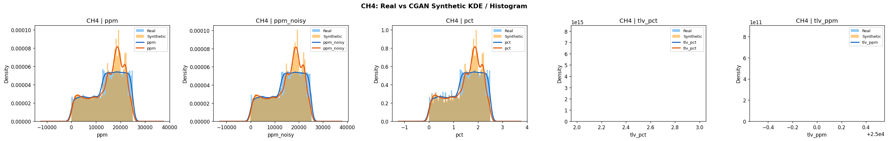

### 2. Boxplots Analysis

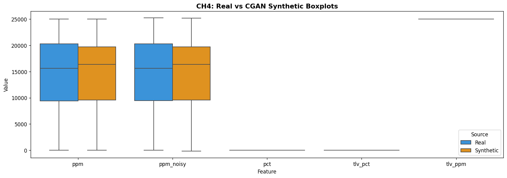

### 3. Statistical Summary

| Feature   |   Real_Mean |   Syn_Mean |   Real_Std |   Syn_Std |   Real_Median |   Syn_Median |   Mean_Bias_% |
|:----------|------------:|-----------:|-----------:|----------:|--------------:|-------------:|--------------:|
| ppm       |    14600.6  |  14618.9   |   6890.95  |  6678.14  |     15620     |    16360     |          0.13 |
| ppm_noisy |    14600.8  |  14618.8   |   6891.92  |  6679.2   |     15617.8   |    16363.3   |          0.12 |
| pct       |        1.46 |      1.462 |      0.689 |     0.668 |         1.562 |        1.636 |          0.13 |
| tlv_pct   |        2.5  |      2.5   |      0     |     0     |         2.5   |        2.5   |          0    |
| tlv_ppm   |    25000    |  25000     |      0     |     0     |     25000     |    25000     |          0    |

### 4. Correlation Heatmaps

**Frobenius Norm of Correlation Difference**: `nan` (threshold ≤ 0.15)

### 5. PCA Projection (2D)

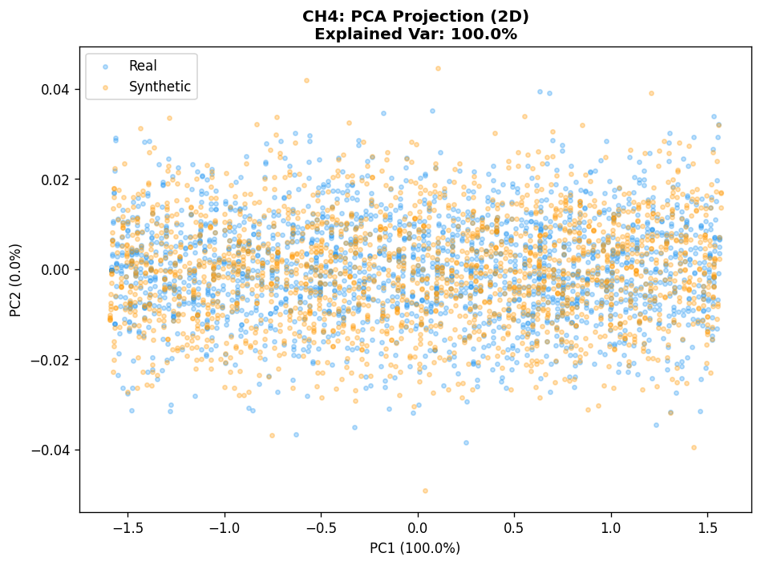

**PCA Explained Variance**: 100.0%  
**PCA Centroid Distance**: `0.0003`

### 6. t-SNE Embedding

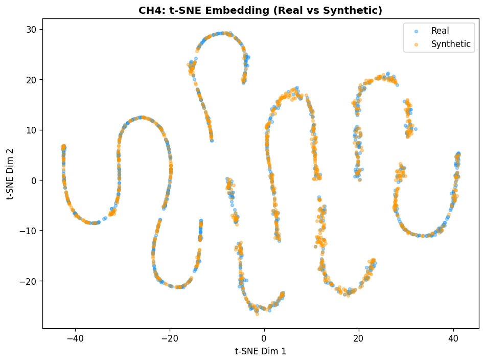

**t-SNE Centroid Distance**: `2.485599994659424`

### 7. Kolmogorov-Smirnov (KS) Test

| Feature   |   KS_D_Statistic |   KS_p_value | Pass (p>0.05)   |
|:----------|-----------------:|-------------:|:----------------|
| ppm       |           0.0565 |            0 | FAIL            |
| ppm_noisy |           0.0569 |            0 | FAIL            |
| pct       |           0.0565 |            0 | FAIL            |
| tlv_pct   |           0      |            1 | PASS            |
| tlv_ppm   |           0      |            1 | PASS            |

### 8. Wasserstein Distance

| Feature   |   Wasserstein_Distance |
|:----------|-----------------------:|
| ppm       |               422.626  |
| ppm_noisy |               424.076  |
| pct       |                 0.0423 |
| tlv_pct   |                 0      |
| tlv_ppm   |                 0      |

### 9. Maximum Mean Discrepancy (MMD)

| Metric | Value | Threshold | Status |
| :--- | :---: | :---: | :---: |
| MMD^2 (RBF kernel) | `0.008453` | ≤ 0.01 | **PASS (Good)** |

### 10. TSTR — Train Synthetic, Test Real

| Metric | Value |
| :--- | :---: |
| TSTR Accuracy | **99.88%** |

### 11. TRTS — Train Real, Test Synthetic

| Metric | Value |
| :--- | :---: |
| TRTS Accuracy | **99.62%** |

### 12. Classifier Distinguishability

| Metric | Value | Target | Status |
| :--- | :---: | :---: | :---: |
| Discriminator AUC | `0.4649` | ~0.50 | **EXCELLENT (Indistinguishable)** |
| Discriminator Accuracy | `47.6%` | ~50% | - |

### 13. Time-Series Autocorrelation

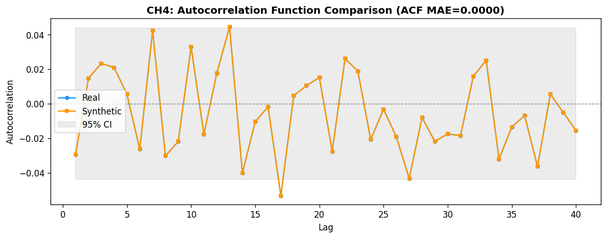

| Metric | Value | Threshold | Status |
| :--- | :---: | :---: | :---: |
| ACF MAE | `0.0` | ≤ 0.05 | **PASS (Good)** |

---

## CO Gas — Full Evaluation

### 1. Histogram / KDE Overlap

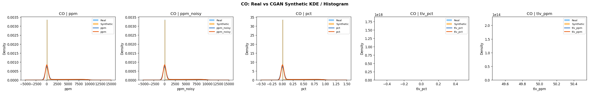

### 2. Boxplots Analysis

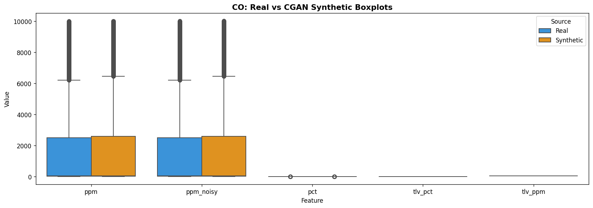

### 3. Statistical Summary

| Feature   |   Real_Mean |   Syn_Mean |   Real_Std |   Syn_Std |   Real_Median |   Syn_Median |   Mean_Bias_% |
|:----------|------------:|-----------:|-----------:|----------:|--------------:|-------------:|--------------:|
| ppm       |    1679.02  |   1705.28  |   2854.97  |  2868.12  |        43.9   |       44.047 |          1.56 |
| ppm_noisy |    1679.04  |   1705.34  |   2854.94  |  2868.06  |        43.814 |       44.078 |          1.57 |
| pct       |       0.168 |      0.171 |      0.285 |     0.287 |         0.004 |        0.004 |          1.56 |
| tlv_pct   |       0.005 |      0.005 |      0     |     0     |         0.005 |        0.005 |          0    |
| tlv_ppm   |      50     |     50     |      0     |     0     |        50     |       50     |          0    |

### 4. Correlation Heatmaps

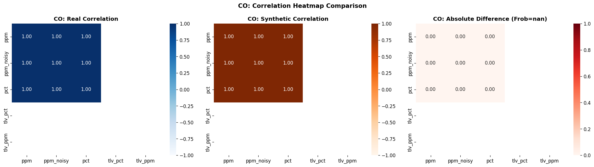

**Frobenius Norm of Correlation Difference**: `nan` (threshold ≤ 0.15)

### 5. PCA Projection (2D)

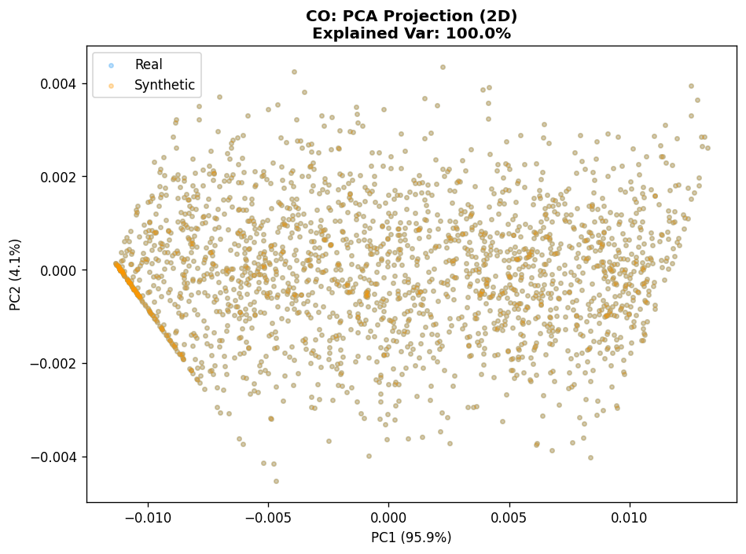

**PCA Explained Variance**: 100.0%  
**PCA Centroid Distance**: `0.0`

### 6. t-SNE Embedding

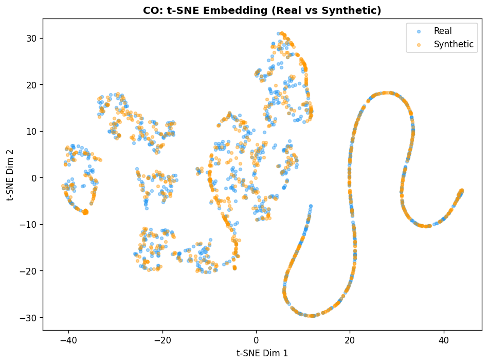

**t-SNE Centroid Distance**: `0.4472000002861023`

### 7. Kolmogorov-Smirnov (KS) Test

| Feature   |   KS_D_Statistic |   KS_p_value | Pass (p>0.05)   |
|:----------|-----------------:|-------------:|:----------------|
| ppm       |           0.0592 |       0      | FAIL            |
| ppm_noisy |           0.0132 |       0.0018 | FAIL            |
| pct       |           0.0592 |       0      | FAIL            |
| tlv_pct   |           0      |       1      | PASS            |
| tlv_ppm   |           0      |       1      | PASS            |

### 8. Wasserstein Distance

| Feature   |   Wasserstein_Distance |
|:----------|-----------------------:|
| ppm       |                42.0399 |
| ppm_noisy |                41.7037 |
| pct       |                 0.0042 |
| tlv_pct   |                 0      |
| tlv_ppm   |                 0      |

### 9. Maximum Mean Discrepancy (MMD)

| Metric | Value | Threshold | Status |
| :--- | :---: | :---: | :---: |
| MMD^2 (RBF kernel) | `0.000755` | ≤ 0.01 | **PASS (Good)** |

### 10. TSTR — Train Synthetic, Test Real

| Metric | Value |
| :--- | :---: |
| TSTR Accuracy | **99.93%** |

### 11. TRTS — Train Real, Test Synthetic

| Metric | Value |
| :--- | :---: |
| TRTS Accuracy | **97.7%** |

### 12. Classifier Distinguishability

| Metric | Value | Target | Status |
| :--- | :---: | :---: | :---: |
| Discriminator AUC | `0.3461` | ~0.50 | **EXCELLENT (Indistinguishable)** |
| Discriminator Accuracy | `39.59%` | ~50% | - |

### 13. Time-Series Autocorrelation

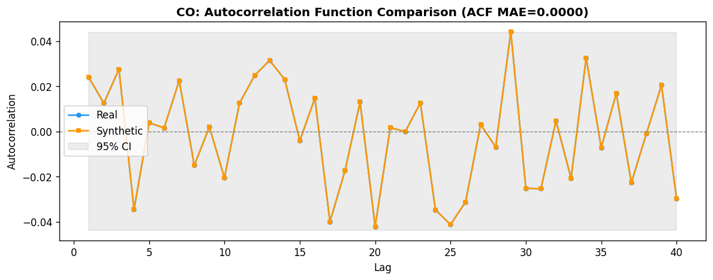

| Metric | Value | Threshold | Status |
| :--- | :---: | :---: | :---: |
| ACF MAE | `0.0` | ≤ 0.05 | **PASS (Good)** |

---

## CO2 Gas — Full Evaluation

### 1. Histogram / KDE Overlap

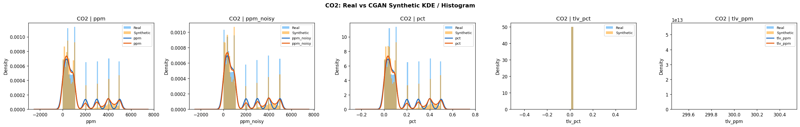

### 2. Boxplots Analysis

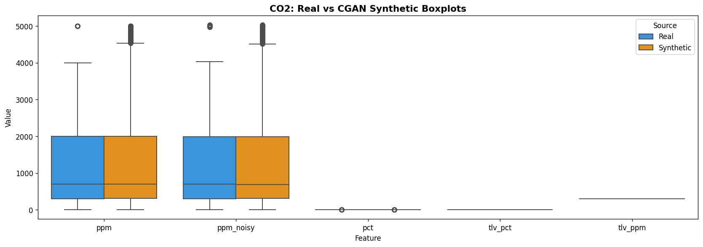

### 3. Statistical Summary

| Feature   |   Real_Mean |   Syn_Mean |   Real_Std |   Syn_Std |   Real_Median |   Syn_Median |   Mean_Bias_% |
|:----------|------------:|-----------:|-----------:|----------:|--------------:|-------------:|--------------:|
| ppm       |    1305.47  |   1356.69  |   1480.26  |  1540.16  |       700     |      694.294 |          3.92 |
| ppm_noisy |    1305.74  |   1356.8   |   1480.18  |  1540.16  |       700.373 |      684.321 |          3.91 |
| pct       |       0.131 |      0.136 |      0.148 |     0.154 |         0.07  |        0.069 |          3.92 |
| tlv_pct   |       0.03  |      0.03  |      0     |     0     |         0.03  |        0.03  |          0    |
| tlv_ppm   |     300     |    300     |      0     |     0     |       300     |      300     |          0    |

### 4. Correlation Heatmaps

**Frobenius Norm of Correlation Difference**: `nan` (threshold ≤ 0.15)

### 5. PCA Projection (2D)

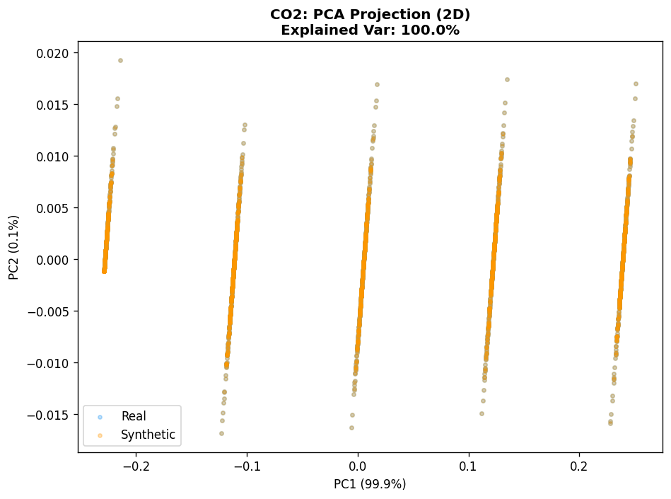

**PCA Explained Variance**: 100.0%  
**PCA Centroid Distance**: `0.0`

### 6. t-SNE Embedding

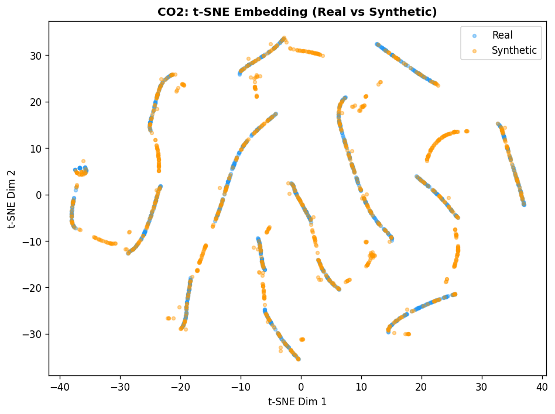

**t-SNE Centroid Distance**: `0.374099999666214`

### 7. Kolmogorov-Smirnov (KS) Test

| Feature   |   KS_D_Statistic |   KS_p_value | Pass (p>0.05)   |
|:----------|-----------------:|-------------:|:----------------|
| ppm       |           0.045  |            0 | FAIL            |
| ppm_noisy |           0.0444 |            0 | FAIL            |
| pct       |           0.045  |            0 | FAIL            |
| tlv_pct   |           0      |            1 | PASS            |
| tlv_ppm   |           0      |            1 | PASS            |

### 8. Wasserstein Distance

| Feature   |   Wasserstein_Distance |
|:----------|-----------------------:|
| ppm       |                81.3578 |
| ppm_noisy |                79.3385 |
| pct       |                 0.0081 |
| tlv_pct   |                 0      |
| tlv_ppm   |                 0      |

### 9. Maximum Mean Discrepancy (MMD)

| Metric | Value | Threshold | Status |
| :--- | :---: | :---: | :---: |
| MMD^2 (RBF kernel) | `0.001572` | ≤ 0.01 | **PASS (Good)** |

### 10. TSTR — Train Synthetic, Test Real

| Metric | Value |
| :--- | :---: |
| TSTR Accuracy | **90.99%** |

### 11. TRTS — Train Real, Test Synthetic

| Metric | Value |
| :--- | :---: |
| TRTS Accuracy | **93.02%** |

### 12. Classifier Distinguishability

| Metric | Value | Target | Status |
| :--- | :---: | :---: | :---: |
| Discriminator AUC | `0.3473` | ~0.50 | **EXCELLENT (Indistinguishable)** |
| Discriminator Accuracy | `39.25%` | ~50% | - |

### 13. Time-Series Autocorrelation

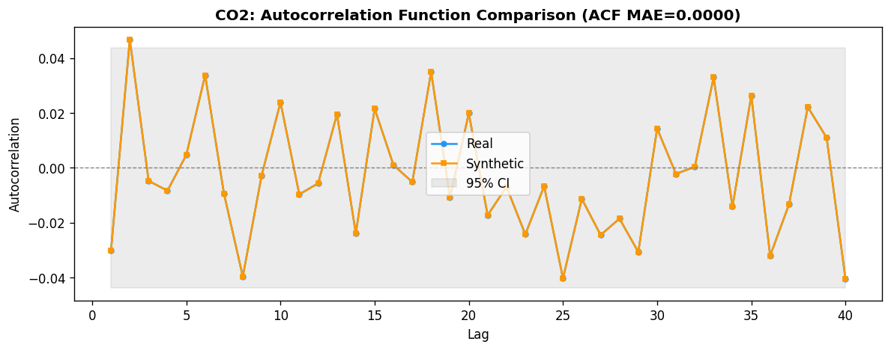

| Metric | Value | Threshold | Status |
| :--- | :---: | :---: | :---: |
| ACF MAE | `0.0` | ≤ 0.05 | **PASS (Good)** |

---

## H2 Gas — Full Evaluation

### 1. Histogram / KDE Overlap

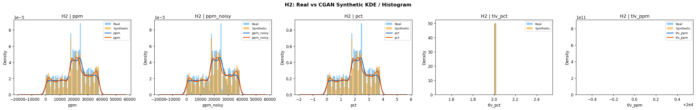

### 2. Boxplots Analysis

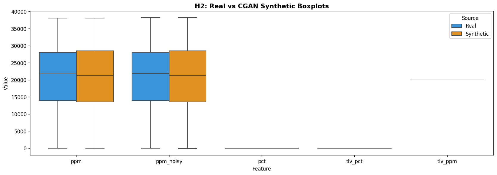

### 3. Statistical Summary

| Feature   |   Real_Mean |   Syn_Mean |   Real_Std |   Syn_Std |   Real_Median |   Syn_Median |   Mean_Bias_% |
|:----------|------------:|-----------:|-----------:|----------:|--------------:|-------------:|--------------:|
| ppm       |   20670.9   |  20691.6   |  10113.6   | 10294.9   |       22000   |    21271.3   |           0.1 |
| ppm_noisy |   20671.1   |  20691.6   |  10113     | 10294.5   |       21902.6 |    21274.5   |           0.1 |
| pct       |       2.067 |      2.069 |      1.011 |     1.029 |           2.2 |        2.127 |           0.1 |
| tlv_pct   |       2     |      2     |      0     |     0     |           2   |        2     |           0   |
| tlv_ppm   |   20000     |  20000     |      0     |     0     |       20000   |    20000     |           0   |

### 4. Correlation Heatmaps

**Frobenius Norm of Correlation Difference**: `nan` (threshold ≤ 0.15)

### 5. PCA Projection (2D)

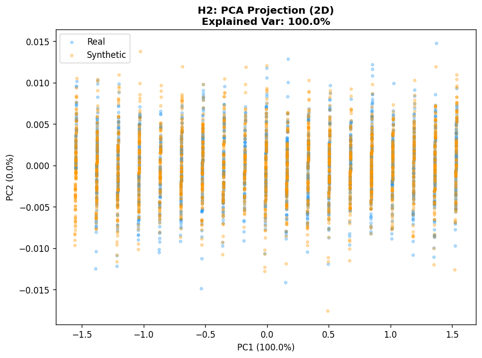

**PCA Explained Variance**: 100.0%  
**PCA Centroid Distance**: `0.0`

### 6. t-SNE Embedding

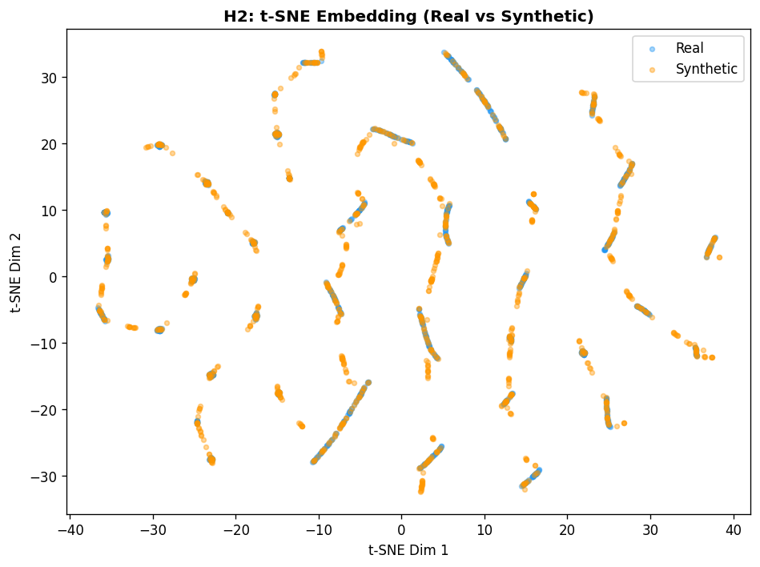

**t-SNE Centroid Distance**: `0.8806999921798706`

### 7. Kolmogorov-Smirnov (KS) Test

| Feature   |   KS_D_Statistic |   KS_p_value | Pass (p>0.05)   |
|:----------|-----------------:|-------------:|:----------------|
| ppm       |           0.0319 |            0 | FAIL            |
| ppm_noisy |           0.0294 |            0 | FAIL            |
| pct       |           0.0319 |            0 | FAIL            |
| tlv_pct   |           0      |            1 | PASS            |
| tlv_ppm   |           0      |            1 | PASS            |

### 8. Wasserstein Distance

| Feature   |   Wasserstein_Distance |
|:----------|-----------------------:|
| ppm       |               309.384  |
| ppm_noisy |               302.597  |
| pct       |                 0.0309 |
| tlv_pct   |                 0      |
| tlv_ppm   |                 0      |

### 9. Maximum Mean Discrepancy (MMD)

| Metric | Value | Threshold | Status |
| :--- | :---: | :---: | :---: |
| MMD^2 (RBF kernel) | `0.000935` | ≤ 0.01 | **PASS (Good)** |

### 10. TSTR — Train Synthetic, Test Real

| Metric | Value |
| :--- | :---: |
| TSTR Accuracy | **95.66%** |

### 11. TRTS — Train Real, Test Synthetic

| Metric | Value |
| :--- | :---: |
| TRTS Accuracy | **97.43%** |

### 12. Classifier Distinguishability

| Metric | Value | Target | Status |
| :--- | :---: | :---: | :---: |
| Discriminator AUC | `0.4965` | ~0.50 | **EXCELLENT (Indistinguishable)** |
| Discriminator Accuracy | `49.38%` | ~50% | - |

### 13. Time-Series Autocorrelation

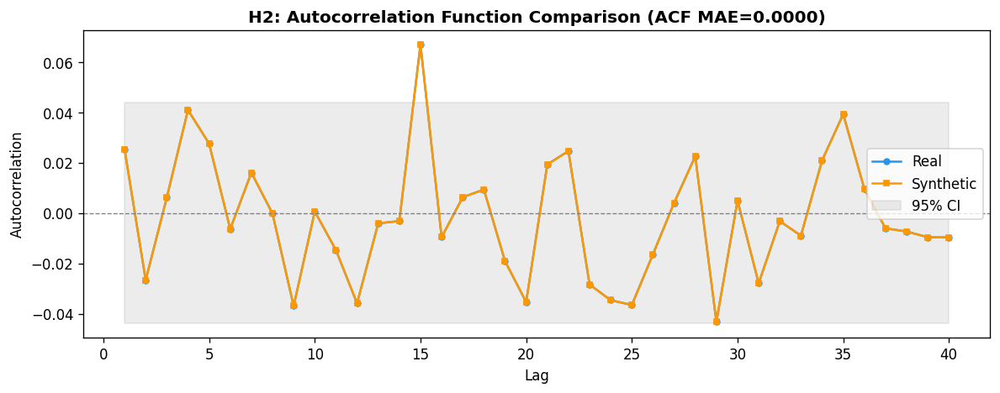

| Metric | Value | Threshold | Status |
| :--- | :---: | :---: | :---: |
| ACF MAE | `0.0` | ≤ 0.05 | **PASS (Good)** |

---

