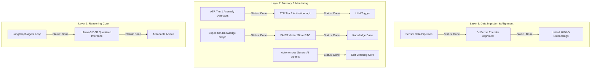

# FIELD-MIND: Software Development Roadmap

This roadmap outlines the software architecture of **FIELD-MIND** as defined in the research proposal and details the current implementation status of each component along with next steps for development.

---

## 🗺️ System Architecture & Status Overview

FIELD-MIND is designed as a six-layer pipeline deployed on-device. The matrix below shows the status of each core software layer:

---

## 🛠️ Detailed Roadmap by Component

### 1. Sensor-Specific Processing Pipelines & Local Models (SciSense Layer 1 / ATR Tier 1)
* **Status**: 🟢 **Completed**
* **Description**: Modality-specific preprocessing, feature engineering, and training pipelines for distinct sensor inputs. These serve as the continuous continuous-monitoring Tier 1 anomaly triggers.
* **Implemented Features**:
  * **Gas Sensors**: Preprocessing, dataset generators, and training scripts for Methane, Multi-Gas detection, and Smoke/Fire alerts.
    * Scripts: [train.py](file:///c:/Users/Student/Desktop/FIELD_MIND - NEW/gas_sensors/train.py), [train_gas_detector.py](file:///c:/Users/Student/Desktop/FIELD_MIND - NEW/gas_sensors/train_gas_detector.py), [train_methane.py](file:///c:/Users/Student/Desktop/FIELD_MIND - NEW/gas_sensors/train_methane.py)
  * **Environmental Anomaly Detection**: Temperature, humidity, and occupancy pipelines using Isolation Forests.
    * Scripts: [preprocess.py](file:///c:/Users/Student/Desktop/FIELD_MIND - NEW/temperature_humidity/src/preprocess.py), [train.py](file:///c:/Users/Student/Desktop/FIELD_MIND - NEW/temperature_humidity/src/train.py), [run_pipeline.py](file:///c:/Users/Student/Desktop/FIELD_MIND - NEW/temperature_humidity/src/run_pipeline.py)
  * **Blast Vibration analysis**: Custom SEG-Y binary file parsing and PPV hazard prediction.
    * Scripts: [vibration_data_prep.py](file:///c:/Users/Student/Desktop/FIELD_MIND - NEW/vibration/vibration_data_prep.py), [train_models.py](file:///c:/Users/Student/Desktop/FIELD_MIND - NEW/vibration/train_models.py)
  * **Ultrasonic Sensors**: 2, 4, and 24-sensor classification pipelines for robot navigation steering commands.
    * Scripts: [train_models.py](file:///c:/Users/Student/Desktop/FIELD_MIND - NEW/ultrasonic_sensors/train_models.py)

---

### 2. SciSense Protocol - Unified Alignment Space
* **Status**: 🟢 **Completed**
* **Description**: Aligning heterogeneous sensor streams (waveforms, concentrations, images, text metadata) into a shared 4,096-dimensional embedding space.
* **Implemented Features**:
  * **Neural Projection Encoders**: Custom PyTorch modules projecting Methane/CO/LPG gas, Temperature/Humidity env, Seismic vibration, and Ultrasound features into a joint L2-normalized embedding.
    * Scripts: [encoders.py](file:///c:/Users/Student/Desktop/FIELD_MIND - NEW/scisense_protocol/encoders.py)
  * **Temporal Stream Aligner**: Dynamic resampling algorithm grouping asynchronous sensors into unified 1-second interval epochs.
    * Scripts: [alignment.py](file:///c:/Users/Student/Desktop/FIELD_MIND - NEW/scisense_protocol/alignment.py)
  * **Simulation Runner**: Demonstration code executing simulated sensor projections and computing cross-modality cosine similarities.
    * Scripts: [demo_alignment.py](file:///c:/Users/Student/Desktop/FIELD_MIND - NEW/scisense_protocol/demo_alignment.py)

---

### 3. Anomaly-Triggered Reasoning (ATR) - Tier 2 Activation
* **Status**: 🟢 **Completed**
* **Description**: Implementing the power-aware activation gate. It runs lightweight anomaly detectors (Isolation Forests, Random Forests) continuously at low power and triggers the SciSense embedding alignment and larger 3B model only when anomaly thresholds are breached.
* **Implemented Features**:
  * **Unified Model Monitors**: Loads and runs inference across all 13 pre-trained scikit-learn models from the gas, environmental, vibration, and navigation domains with robust fallback mappings.
    * Scripts: [detector_wrappers.py](file:///c:/Users/Student/Desktop/FIELD_MIND - NEW/atr_activation/detector_wrappers.py)
  * **ATR Orchestrator**: Manages power states (`IDLE` vs. `ACTIVE_REASONING`) and triggers the SciSense Protocol embedding projections on temporal windows when a hazard alert occurs.
    * Scripts: [orchestrator.py](file:///c:/Users/Student/Desktop/FIELD_MIND - NEW/atr_activation/orchestrator.py)
  * **Ingestion Simulator**: Demonstrates end-to-end telemetry ingestion using real dataset slices to trigger transitions and recover idle memory states.
    * Scripts: [demo_atr.py](file:///c:/Users/Student/Desktop/FIELD_MIND - NEW/atr_activation/demo_atr.py)

---

### 4. Expedition Knowledge Graph (EKG)
* **Status**: 🟢 **Completed**
* **Description**: Persistent site memory mapping spatial and temporal coordinates of mine operations (tunnels, blasts, machinery, anomalies) using a NetworkX property graph with JSON persistence.
* **Implemented Features**:
  * **Property Graph Schema**: 8 typed node classes (TunnelSegment, SensorNode, BlastEvent, VibrationEvent, GasAnomaly, EnvironmentalReading, NavigationEvent, Equipment) with 7 typed edge relationships.
    * Scripts: [schema.py](file:///c:/Users/Student/Desktop/FIELD_MIND - NEW/expedition_knowledge_graph/schema.py)
  * **Graph Store Engine**: NetworkX-backed directed graph with label indexing, BFS traversal, temporal window queries, and full JSON serialisation.
    * Scripts: [graph_store.py](file:///c:/Users/Student/Desktop/FIELD_MIND - NEW/expedition_knowledge_graph/graph_store.py)
  * **Data Ingestion Pipelines**: Populates graph from blast/vibration CSV (62 blasts, 310 vibration events), gas anomaly CSV (547 events), environmental telemetry CSV (200 readings), and live robot navigation events (260 events), plus sensor and equipment nodes.
    * Scripts: [ingest.py](file:///c:/Users/Student/Desktop/FIELD_MIND - NEW/expedition_knowledge_graph/ingest.py)
  * **Query API**: High-level functions for risk profiling, gas trend analysis, blast history, event correlation, equipment status, sensor inventory, and navigation events.
    * Scripts: [query_api.py](file:///c:/Users/Student/Desktop/FIELD_MIND - NEW/expedition_knowledge_graph/query_api.py)
  * **Demo Runner**: End-to-end ingestion, query, and persistence verification.
    * Scripts: [demo_ekg.py](file:///c:/Users/Student/Desktop/FIELD_MIND - NEW/expedition_knowledge_graph/demo_ekg.py)

---

### 5. FAISS Vector Database (RAG)
* **Status**: 🟢 **Completed**
* **Description**: Offline local index of dense scientific literature, incident reports, mining regulations, and manuals. Provides semantic retrieval context for the downstream reasoning core.
* **Implemented Features**:
  * **Document Chunker**: Overlapping fixed-size text windows (1200 chars, 200 overlap) from Markdown/text files with source metadata.
    * Scripts: [chunker.py](file:///c:/Users/Student/Desktop/FIELD_MIND - NEW/faiss_rag/chunker.py)
  * **Sentence Embedder**: CPU-only `all-MiniLM-L6-v2` (22 MB, 384-dim) via `sentence-transformers`. Lazy-loaded, L2-normalized output.
    * Scripts: [embedder.py](file:///c:/Users/Student/Desktop/FIELD_MIND - NEW/faiss_rag/embedder.py)
  * **FAISS Index Builder**: `IndexFlatIP` (exact cosine similarity search). Build, save, and load from disk (`faiss_index.bin` + `chunks_metadata.json`).
    * Scripts: [index_builder.py](file:///c:/Users/Student/Desktop/FIELD_MIND - NEW/faiss_rag/index_builder.py)
  * **RAG Retriever**: Top-K semantic search with overlap deduplication, similarity score filtering, and LLM-ready context formatting.
    * Scripts: [retriever.py](file:///c:/Users/Student/Desktop/FIELD_MIND - NEW/faiss_rag/retriever.py)
  * **Mining Safety Knowledge Base**: 5 authoritative Markdown documents covering gas thresholds (IS/OSHA/NIOSH), PPV standards (IS 6922/ISEE/USBM), environmental limits, robot navigation protocols, and the full FIELD-MIND system architecture.
    * Docs: [knowledge_base/](file:///c:/Users/Student/Desktop/FIELD_MIND - NEW/faiss_rag/knowledge_base/)
  * **Demo Runner**: End-to-end build + 14 sample mining safety queries. Avg query time: **6.3 ms** (CPU-only).
    * Scripts: [demo_rag.py](file:///c:/Users/Student/Desktop/FIELD_MIND - NEW/faiss_rag/demo_rag.py)

---

### 6. Scientific Reasoning Core (LangGraph + Quantized Llama)
* **Status**: 🟢 **Completed**
* **Description**: Local agent loop utilizing `Llama-3.2-3B-Instruct-GGUF` (4-bit quantized) via llama.cpp or local runtime to perform offline structured reasoning. Includes a high-quality expert rule fallback for on-device execution on limited hardware.
* **Implemented Features**:
  * **LangGraph State Machine**: Implements the compiled diagnostic loop: `OBSERVE` (reads anomaly) $\rightarrow$ `EKG-RETRIEVE` (retrieves segment history) $\rightarrow$ `RAG-RETRIEVE` (queries FAISS safety database) $\rightarrow$ `HYPOTHESIZE` (identifies root cause) $\rightarrow$ `SUGGEST` (generates safety recommendations) $\rightarrow$ `UPDATE_EKG` (links and saves to NetworkX).
    * Scripts: [agent_loop.py](file:///c:/Users/Student/Desktop/FIELD_MIND - NEW/reasoning_core/agent_loop.py)
  * **LLM & Expert System Runner**: Integrates llama-cpp-python GGUF runner with a domain-informed Expert Rule Engine fallback when local 3B model is absent.
    * Scripts: [llm_runner.py](file:///c:/Users/Student/Desktop/FIELD_MIND - NEW/reasoning_core/llm_runner.py)
  * **Agent State Schema**: Shared state container tracking anomalies, EKG history, RAG context, LLM output, and execution logs.
    * Scripts: [state.py](file:///c:/Users/Student/Desktop/FIELD_MIND - NEW/reasoning_core/state.py)
  * **Scenarios Demo Runner**: Runs the compiled workflow on simulated coal gas pockets, blast vibrations, and robot collision scenarios.
    * Scripts: [demo_reasoning.py](file:///c:/Users/Student/Desktop/FIELD_MIND - NEW/reasoning_core/demo_reasoning.py)

---

### 7. Natural Language User Interface
* **Status**: 🔴 **To Be Done**
* **Description**: Local rugged tablet interface with web dashboard (FastAPI) and offline voice/speech commands.
* **Next Steps**:
  * Develop a local FastAPI server to host the API endpoints and serve a React or static HTML/JS dashboard.
  * Integrate an offline Automatic Speech Recognition (ASR) engine (like Whisper-cpp or Vosk) to parse vocal queries into structured commands.

---

### 8. Autonomous Sensor AI Agent Layer
* **Status**: 🟢 **Completed**
* **Description**: Decoupled, event-driven agent infrastructure where each sensor type acts autonomously, communicates hazards via a pub/sub bus, and self-learns using an experience replay buffer grounded in original datasets.
* **Implemented Features**:
  * **Pub/Sub Broker**: A lightweight message bus handling asynchronous inter-agent signaling.
    * Scripts: [agent_bus.py](file:///c:/Users/Student/Desktop/FIELD_MIND - NEW/sensor_agents/agent_bus.py)
  * **Lifecycle Agent Base**: Standardized Observe -> Reason -> Act -> Learn loop base class implementing dataset replay buffers for online learning.
    * Scripts: [agent_base.py](file:///c:/Users/Student/Desktop/FIELD_MIND - NEW/sensor_agents/agent_base.py)
  * **Domain AI Agents**: Specialized agents for Gas, Environmental, Blast Vibration, and Ultrasonic robot navigation.
    * Scripts: [gas_agent.py](file:///c:/Users/Student/Desktop/FIELD_MIND - NEW/sensor_agents/gas_agent.py), [env_agent.py](file:///c:/Users/Student/Desktop/FIELD_MIND - NEW/sensor_agents/env_agent.py), [vibration_agent.py](file:///c:/Users/Student/Desktop/FIELD_MIND - NEW/sensor_agents/vibration_agent.py), [ultrasonic_agent.py](file:///c:/Users/Student/Desktop/FIELD_MIND - NEW/sensor_agents/ultrasonic_agent.py)
  * **Memory & Orchestration Agents**: EKG Agent subscribing to alerts to update the knowledge graph, and a global Orchestrator Agent using weighted evidence fusion.
    * Scripts: [ekg_agent.py](file:///c:/Users/Student/Desktop/FIELD_MIND - NEW/sensor_agents/ekg_agent.py), [mine_orchestrator_agent.py](file:///c:/Users/Student/Desktop/FIELD_MIND - NEW/sensor_agents/mine_orchestrator_agent.py)
  * **End-to-End Simulation**: Streams real dataset entries to trigger alerts, transitions global orchestrator state (IDLE <-> ACTIVE_REASONING <-> EMERGENCY), and demonstrates on-line model refits.
    * Scripts: [demo_agents.py](file:///c:/Users/Student/Desktop/FIELD_MIND - NEW/sensor_agents/demo_agents.py)
