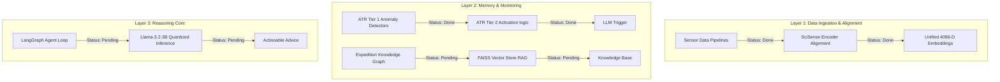

# FIELD-MIND: Software Development Roadmap

This roadmap outlines the software architecture of **FIELD-MIND** as defined in the research proposal and details the current implementation status of each component along with next steps for development.

---

## 🗺️ System Architecture & Status Overview

FIELD-MIND is designed as a six-layer pipeline deployed on-device. The matrix below shows the status of each core software layer:

---

## 🛠️ Detailed Roadmap by Component

### 1. Sensor-Specific Processing Pipelines & Local Models (SciSense Layer 1 / ATR Tier 1)
* **Status**: 🟢 **Completed**
* **Description**: Modality-specific preprocessing, feature engineering, and training pipelines for distinct sensor inputs. These serve as the continuous continuous-monitoring Tier 1 anomaly triggers.
* **Implemented Features**:
  * **Gas Sensors**: Preprocessing, dataset generators, and training scripts for Methane, Multi-Gas detection, and Smoke/Fire alerts.
    * Scripts: [train.py](file:///c:/Users/Student/Desktop/FIELD_MIND - NEW/gas_sensors/train.py), [train_gas_detector.py](file:///c:/Users/Student/Desktop/FIELD_MIND - NEW/gas_sensors/train_gas_detector.py), [train_methane.py](file:///c:/Users/Student/Desktop/FIELD_MIND - NEW/gas_sensors/train_methane.py)
  * **Environmental Anomaly Detection**: Temperature, humidity, and occupancy pipelines using Isolation Forests.
    * Scripts: [preprocess.py](file:///c:/Users/Student/Desktop/FIELD_MIND - NEW/temperature_humidity/src/preprocess.py), [train.py](file:///c:/Users/Student/Desktop/FIELD_MIND - NEW/temperature_humidity/src/train.py), [run_pipeline.py](file:///c:/Users/Student/Desktop/FIELD_MIND - NEW/temperature_humidity/src/run_pipeline.py)
  * **Blast Vibration analysis**: Custom SEG-Y binary file parsing and PPV hazard prediction.
    * Scripts: [vibration_data_prep.py](file:///c:/Users/Student/Desktop/FIELD_MIND - NEW/vibration/vibration_data_prep.py), [train_models.py](file:///c:/Users/Student/Desktop/FIELD_MIND - NEW/vibration/train_models.py)
  * **Ultrasonic Sensors**: 2, 4, and 24-sensor classification pipelines for robot navigation steering commands.
    * Scripts: [train_models.py](file:///c:/Users/Student/Desktop/FIELD_MIND - NEW/ultrasonic_sensors/train_models.py)

---

### 2. SciSense Protocol - Unified Alignment Space
* **Status**: 🟢 **Completed**
* **Description**: Aligning heterogeneous sensor streams (waveforms, concentrations, images, text metadata) into a shared 4,096-dimensional embedding space.
* **Implemented Features**:
  * **Neural Projection Encoders**: Custom PyTorch modules projecting Methane/CO/LPG gas, Temperature/Humidity env, Seismic vibration, and Ultrasound features into a joint L2-normalized embedding.
    * Scripts: [encoders.py](file:///c:/Users/Student/Desktop/FIELD_MIND - NEW/scisense_protocol/encoders.py)
  * **Temporal Stream Aligner**: Dynamic resampling algorithm grouping asynchronous sensors into unified 1-second interval epochs.
    * Scripts: [alignment.py](file:///c:/Users/Student/Desktop/FIELD_MIND - NEW/scisense_protocol/alignment.py)
  * **Simulation Runner**: Demonstration code executing simulated sensor projections and computing cross-modality cosine similarities.
    * Scripts: [demo_alignment.py](file:///c:/Users/Student/Desktop/FIELD_MIND - NEW/scisense_protocol/demo_alignment.py)

---

### 3. Anomaly-Triggered Reasoning (ATR) - Tier 2 Activation
* **Status**: 🟢 **Completed**
* **Description**: Implementing the power-aware activation gate. It runs lightweight anomaly detectors (Isolation Forests, Random Forests) continuously at low power and triggers the SciSense embedding alignment and larger 3B model only when anomaly thresholds are breached.
* **Implemented Features**:
  * **Unified Model Monitors**: Loads and runs inference across all 13 pre-trained scikit-learn models from the gas, environmental, vibration, and navigation domains with robust fallback mappings.
    * Scripts: [detector_wrappers.py](file:///c:/Users/Student/Desktop/FIELD_MIND - NEW/atr_activation/detector_wrappers.py)
  * **ATR Orchestrator**: Manages power states (`IDLE` vs. `ACTIVE_REASONING`) and triggers the SciSense Protocol embedding projections on temporal windows when a hazard alert occurs.
    * Scripts: [orchestrator.py](file:///c:/Users/Student/Desktop/FIELD_MIND - NEW/atr_activation/orchestrator.py)
  * **Ingestion Simulator**: Demonstrates end-to-end telemetry ingestion using real dataset slices to trigger transitions and recover idle memory states.
    * Scripts: [demo_atr.py](file:///c:/Users/Student/Desktop/FIELD_MIND - NEW/atr_activation/demo_atr.py)

---

### 4. Expedition Knowledge Graph (EKG)
* **Status**: 🔴 **To Be Done**
* **Description**: Persistent site memory mapping spatial and temporal coordinates of mine operations (tunnels, blasts, machinery, anomalies) in Neo4j.
* **Next Steps**:
  * Set up local Neo4j database configurations.
  * Define the property graph schema (Nodes: `TunnelSegment`, `SensorNode`, `VibrationAnomaly`, `BlastEvent`, `Equipment`).
  * Implement Python connector scripts to dynamically update graph nodes as new sensor telemetry arrives.

---

### 5. FAISS Vector Database (RAG)
* **Status**: 🔴 **To Be Done**
* **Description**: Offline local index of dense scientific literature, incident reports, mining regulations, and manuals.
* **Next Steps**:
  * Gather target documentation files (PDFs, Markdown, text).
  * Write a document chunking and metadata extraction script.
  * Generate embeddings (e.g., via a lightweight HuggingFace sentence transformer) and load them into a FAISS index stored on disk for offline vector search.

---

### 6. Scientific Reasoning Core (LangGraph + Quantized Llama)
* **Status**: 🔴 **To Be Done**
* **Description**: Local agent loop utilizing `Llama-3.2-3B-Instruct-GGUF` (4-bit quantized) via llama.cpp or local runtime to perform offline structured reasoning.
* **Next Steps**:
  * Integrate LangGraph to orchestrate the step loop: `OBSERVE` (read sensor anomaly) $\rightarrow$ `EKG-RETRIEVE` (get local history) $\rightarrow$ `RAG-RETRIEVE` (get literature grounding) $\rightarrow$ `HYPOTHESIZE` $\rightarrow$ `SUGGEST` $\rightarrow$ `UPDATE_EKG`.
  * Set up GGUF model execution using Python bindings (e.g., `llama-cpp-python`).

---

### 7. Natural Language User Interface
* **Status**: 🔴 **To Be Done**
* **Description**: Local rugged tablet interface with web dashboard (FastAPI) and offline voice/speech commands.
* **Next Steps**:
  * Develop a local FastAPI server to host the API endpoints and serve a React or static HTML/JS dashboard.
  * Integrate an offline Automatic Speech Recognition (ASR) engine (like Whisper-cpp or Vosk) to parse vocal queries into structured commands.
