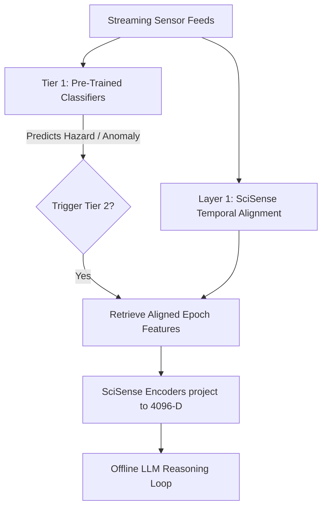

# SciSense Protocol - Unified Alignment Space

The **SciSense Protocol** represents Layer 1 of the FIELD-MIND industrial architecture. It resolves the problem of high heterogeneity in sensor data types, formats, and sample rates by aligning distinct sensor domains (waveforms, concentration indexes, numeric logs, and spatial metrics) into a **shared 4,096-dimensional embedding space**.

---

## 🏗️ Architecture

```
 Physical Sensors            Alignment Layer              Neural Projection Encoders         Embedding Space
(Variable Frequencies)     (Temporal Windowing)               (Shared Dim = 4096)            (Unit Hypersphere)

 [Gas Sensors] --------> [ 1.0s Window Average ] -------> [ GasEncoder ] ----------------+
                                                                                          |
 [Env Sensors] --------> [ 1.0s Window Average ] -------> [ EnvironmentalEncoder ] ------+------> z in R^4096
                                                                                          |      (L2-Normalized)
 [Vibration]   --------> [ Event-based Trigger ] -------> [ VibrationEncoder ] ----------+
                                                                                          |
 [Ultrasonic]  --------> [ 1.0s Window Average ] -------> [ UltrasonicEncoder ] ----------+
```

---

## 📂 Core Files

* **[encoders.py](file:///c:/Users/Student/Desktop/FIELD_MIND - NEW/scisense_protocol/encoders.py)**: PyTorch modules mapping specific sensor dimensions to a joint embedding. Output embeddings are L2-normalized so they represent unit vectors, allowing cosine similarity measures to compare multi-sensor contexts directly.
* **[alignment.py](file:///c:/Users/Student/Desktop/FIELD_MIND - NEW/scisense_protocol/alignment.py)**: Resamples and synchronizes data with divergent frequencies using forward-filling and window averaging to create unified epochs.
* **[demo_alignment.py](file:///c:/Users/Student/Desktop/FIELD_MIND - NEW/scisense_protocol/demo_alignment.py)**: End-to-end execution runner showcasing stream simulation, temporal window alignment, and embedding projection.

---

## 📐 Mathematical Framework

Each modality encoder $M_i$ maps its native input vector $x_i \in \mathbb{R}^{d_i}$ to a hidden representation, which is projected and normalized:

$$h_i = \text{ReLU}(\text{LayerNorm}(\mathbf{W}_{h,i} x_i + b_{h,i}))$$
$$z_i = \frac{\mathbf{W}_{p,i} h_i + b_{p,i}}{\|\mathbf{W}_{p,i} h_i + b_{p,i}\|_2}$$

Where $z_i \in \mathbb{R}^{4096}$ is the unit-length embedding vector. Fusing modalities can be done via dot products (cosine similarity) or direct concatenation:

$$\text{Similarity}(z_{\text{gas}}, z_{\text{ultrasonic}}) = z_{\text{gas}}^T z_{\text{ultrasonic}}$$

## 🤝 Integration with Pre-Trained Classifiers (ATR Tier 1)

While the pre-trained `scikit-learn` classifiers and regressors (such as the Random Forest and Gradient Boosting models) make localized, single-domain predictions (e.g. Methane Alarm, Vibration Hazard), the SciSense Protocol neural encoders project these domains into a unified embedding space.

In the Anomaly-Triggered Reasoning (ATR) workflow, these modules work together:

| Aspect | Pre-Trained Models (Tier 1) | SciSense Protocol Encoders (Layer 1) |
| :--- | :--- | :--- |
| **Objective** | Continuous monitoring and hazard triggers (e.g. `vibration_hazard = 1`). | Joint representation mapping (generates unit-length vectors $z \in \mathbb{R}^{4096}$). |
| **Output** | String/numeric class decision or threshold value. | 4096-dimensional projection vector for LLM analysis. |



---

## 🚀 How to Run the Demo

To run the simulator and project the aligned sensor streams into the 4096-dimensional space:

```bash
python scisense_protocol/demo_alignment.py
```
