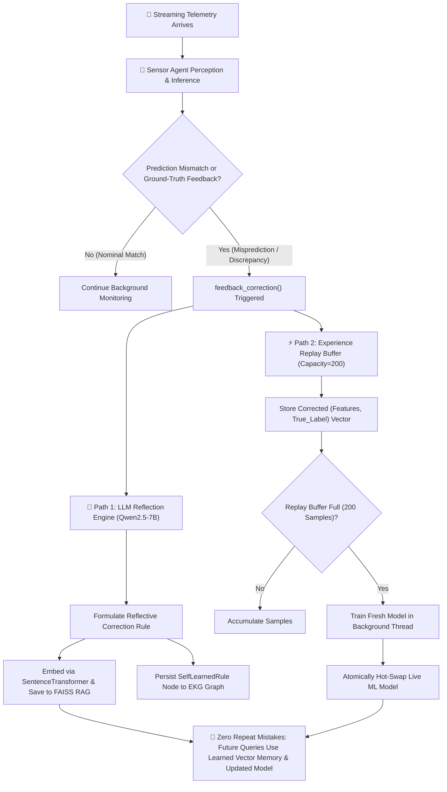

# Sensor Agents — FIELD-MIND Autonomous Multi-Agent Layer

This folder houses the **Autonomous Sensor AI Agent Layer** of the FIELD-MIND system. Every sensor domain is modeled as an independent, self-learning agent running an event-driven loop and communicating over a shared message broker. Optimized for edge deployment on **NVIDIA Jetson Orin Nano (8GB Unified LPDDR5 Memory)**.

---

## Architecture Overview

All agents inherit from a unified base class implementing the **Observe-Reason-Act-Reflect & Learn** loop:
1. **Observe**: Ingests new telemetry data from streaming sensor pipelines or hardware inputs.
2. **Reason**: Runs the raw telemetry through pre-trained PyTorch / ML models to calculate hazard levels and multiclass severity scores.
3. **Act**: If a hazard score exceeds safety thresholds (confidence $\ge 0.5$ for 2+ consecutive ticks), publishes a `BusMessage` ALERT on the AgentBus.
4. **Reflect & Learn ★**: When real-world ground truth differs from a model prediction, calling `feedback_correction()`:
   * **LLM Reflection**: `Qwen2.5-7B-Instruct` formulates a corrective safety rule, dynamically embedding and saving it to FAISS vector memory and the EKG knowledge graph.
   * **Experience Replay & Online Retraining**: Pushes corrected `(feature_vector, true_label)` samples to the Experience Replay Buffer (capacity=200). When full, background retraining refits the local ML model and hot-swaps it atomically without interrupting streaming operations.

---

## 🔄 Autonomous Self-Learning & Reflection Architecture

The flowchart below illustrates how sensor agents handle real-time ground-truth feedback and prediction discrepancies:

### **Dual-Path Self-Learning Mechanics**

1. **Path A: Semantic Vector Memory & LLM Reflection (`reflect_and_learn`)**:
   * **Trigger**: When real-world ground truth differs from initial model output (e.g., high humidity water spray causing sensor drift).
   * **LLM Reasoning**: `Qwen2.5-7B-Instruct-Q4_K_M.gguf` formulates a contextual safety rule (e.g. *"When MQ-7 reads >40 ppm CO at humidity >85%, classify as Water Spray Moisture Drift"*).
   * **FAISS Vector Storage**: The rule is embedded via `SentenceEmbedder` (`all-MiniLM-L6-v2`) and saved to disk (`faiss_index.bin` & `chunks_metadata.json`).
   * **EKG Memory**: A `SelfLearnedRule` node is saved to `mine_graph.json` and linked to the active tunnel segment.

2. **Path B: On-Line Experience Replay & Model Hot-Swapping**:
   * **Buffer Push**: `agent.feedback_correction()` converts features into a vector and appends `(feat_vec, true_label)` to `self._replay_X` and `self._replay_y`.
   * **Buffer Refit**: When the replay buffer reaches 200 samples, background thread training refits the estimator (`model.fit(X_replay, y_replay)`).
   * **Atomic Hot-Swap**: The newly fitted estimator replaces `self.primary_model` atomically, ensuring zero downtime for streaming telemetry.

---

## Agent Directory & Responsibilities

| File | Agent Class | Primary Responsibility | Underlying Models | Dataset for Learning |
|---|---|---|---|---|
| [`gas_agent.py`](file:///c:/Users/Student/Desktop/FIELD_MIND - NEW/sensor_agents/gas_agent.py) | **`GasSensorAgent`** | Tracks gas toxic thresholds, multi-gas presence, and severity levels for Methane, LPG, CO, CO2, H2. | 8 PyTorch DL & Baseline Models (`LayerNormSwishMLP` LPG/CO hazard nets, `LayerNormSwishMLP` 5-gas multi-task net, CH4/CO/CO2/H2 severity MLPs, IsolationForest baseline) | `FIELDMIND_physics_dataset.csv` / `FIELDMIND_real_replay.csv` |
| [`env_agent.py`](file:///c:/Users/Student/Desktop/FIELD_MIND - NEW/sensor_agents/env_agent.py) | **`EnvSensorAgent`** | Monitors microclimate comfort, temp/humidity anomalies, and cabin occupancy. | Isolation Forest, Occupancy Random Forest | `iot_telemetry_clean.csv` |
| [`vibration_agent.py`](file:///c:/Users/Student/Desktop/FIELD_MIND - NEW/sensor_agents/vibration_agent.py) | **`VibrationSensorAgent`** | Predicts blast Peak Particle Velocity (PPV) and logs ground hazards. | Random Forest Classifier, Gradient Boosting Regressor | `vibration_features.csv` |
| [`ultrasonic_agent.py`](file:///c:/Users/Student/Desktop/FIELD_MIND - NEW/sensor_agents/ultrasonic_agent.py) | **`UltrasonicSensorAgent`** | Governs robotic platform collision risk and steering commands. | 24-Sensor Navigation Random Forest | `sensor_readings_24.csv` |
| [`ekg_agent.py`](file:///c:/Users/Student/Desktop/FIELD_MIND - NEW/sensor_agents/ekg_agent.py) | **`EKGAgent`** | Subscribes to the `AgentBus` and writes all triggered alerts directly to EKG memory. | Expedition Knowledge Graph (NetworkX) | N/A (Reactive Logger) |
| [`mine_orchestrator_agent.py`](file:///c:/Users/Student/Desktop/FIELD_MIND - NEW/sensor_agents/mine_orchestrator_agent.py) | **`MineOrchestratorAgent`** | Aggregates and weights alert levels from all agents to control emergency triggers. | Custom Weighted Hazard Score Fusion | N/A (Global Coordinator) |

---

## Supporting Infrastructure

- [`agent_base.py`](file:///c:/Users/Student/Desktop/FIELD_MIND - NEW/sensor_agents/agent_base.py): Core interface for base agent loop, `feedback_correction()`, thread pooling, and experience replay buffer management.
- [`agent_bus.py`](file:///c:/Users/Student/Desktop/FIELD_MIND - NEW/sensor_agents/agent_bus.py): Local event-driven publish/subscribe message broker coordinating asynchronous inter-agent signaling.
- [`demo_agents.py`](file:///c:/Users/Student/Desktop/FIELD_MIND - NEW/sensor_agents/demo_agents.py): Streaming simulation script showing all agents observing data, raising alerts, logging to EKG, and retraining their ML models live.
- [`demo_self_learning.py`](file:///c:/Users/Student/Desktop/FIELD_MIND - NEW/reasoning_core/demo_self_learning.py): Interactive demonstration of real-time discrepancy handling, LLM self-reflection (`Qwen2.5-7B-Instruct`), dynamic FAISS vector memory updates, and online replay buffer retraining.
